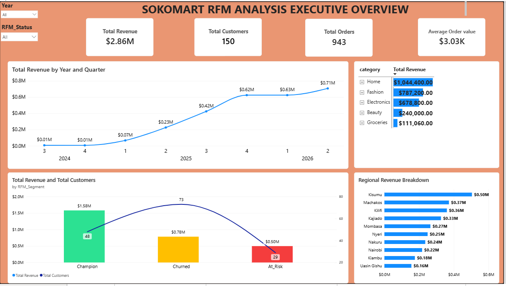
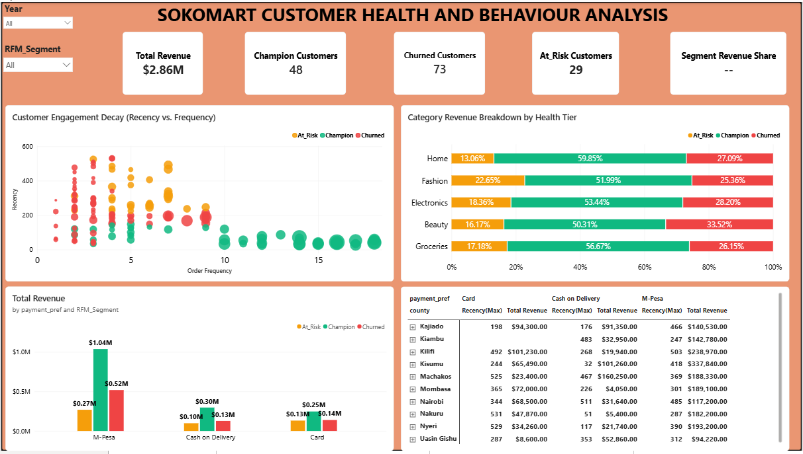
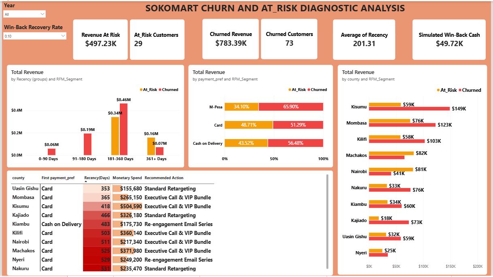

# SokoMart_Performance_and_Sales-Analytics
Enterprise Power BI suite analyzing $2.86M in revenue, customer churn exposure, and dynamic win-back projections.
# Soko Mart: Enterprise Revenue Optimization & Churn Diagnostic Analytics



## 📌 Executive Summary
Soko Mart is an e-commerce platform processing **$2.86M** in total revenue across **943 customer orders**. This project establishes an enterprise-grade Power BI reporting suite designed to monitor sales health, evaluate product category margins, identify dormant customer risk, and simulate recovery potential.

---

## 💡 Key Business Findings
* **Churn Risk Exposure**: **$497.23K (17.4% of total revenue)** is currently sitting in the **At-Risk** RFM customer tier across 29 accounts.
* **Critical Decay Band**: **$340K** of At-Risk capital sits in the **181–360 day inactivity window**, marking the primary target for re-engagement before crossing into permanent churn ($783.39K).
* **High-Margin Drivers**: **Fashion** generates the highest basket yield with an **Average Order Value (AOV) of $4,422.47**, compared to **Groceries ($597.10 AOV)**.
* **Category Baseline**: **Home** serves as the core revenue anchor, driving **$1.04M (36.5% share)** across 244 transactions.

---
---

## 🎯 Strategic Recommendations

| Objective | Target Group / Segment | Tactical Action Plan | Projected Financial Impact |
| :--- | :--- | :--- | :--- |
| **1. Immediate VIP Recovery** | Top 10 At-Risk Accounts (e.g., Kisumu, Kilifi, Machakos) | Deploy direct executive account manager outreach paired with exclusive VIP re-engagement bundles. | Rescuing **20%** restores **$99.44K** in direct top-line cash flow. |
| **2. Channel Retargeting** | Card & M-Pesa At-Risk Segments | Trigger automated M-Pesa promo vouchers and targeted checkout reminders for accounts inactive $>180$ days. | Prevents high-margin accounts from crossing into permanent dead churn. |
| **3. Basket Expansion** | Groceries & Beauty Buyers | Introduce cross-sell bundles (e.g., Home + Beauty pairings) at checkout to convert low-AOV purchases into high-ticket sales. | Elevates overall platform AOV from **$3.03K** closer to the **$4.4K+** Fashion benchmark. |
| **4. Regional Retention** | Machakos, Nairobi & Mombasa | Establish localized field sales initiatives and assigned regional customer success reps in high-decay counties. | Safeguards **$239K+** in localized At-Risk capital exposure. |
## 🛠️ Dashboard Architecture

| Dashboard Page | Purpose & Core Insights |
| :--- | :--- |
| **1. Executive Overview** | High-level business performance, revenue trends, and key regional drivers. |
| **2. Customer Health & Behaviour** | RFM segmentation mapping customer lifetime value against purchase frequency. |
| **3. Product & Sales Performance** | Product category dynamics, order volume vs. AOV scatter analysis, and basket trends. |
| **4. Churn & At-Risk Diagnostic** | Interactive scenario simulator, decay band sorting, and CRM action priority matrices. |

---

## 🧮 Advanced DAX Features & What-If Simulation
The report features a dynamic **What-If Win-Back Simulator** allowing executives to test campaign recovery targets live:

```dax
Simulated Win-Back Cash = 
VAR AtRiskRevenue = CALCULATE([Total Revenue], 'soko_mart Customers'[RFM_Segment] = "At_Risk")
VAR RecoveryPercentage = 'Win-Back Recovery Rate'[Win-Back Recovery Rate Value]
RETURN
    AtRiskRevenue * RecoveryPercentage
```

---

## 📸 Dashboard Gallery

### Page 2: Customer Health & Behaviour


### Page 3: Product & Sales Performance


### Page 4: Churn & At-Risk Diagnostic


---
## 🛠️ Tech Stack & Skills
* **SQL**: Preliminary Data Extraction, ETL, Aggregation, and RFM Customer Scoring.
* **Power BI Desktop**: Data Modeling, UX Design, Custom Visual Layouts, and Conditional Formatting.
* **DAX (Data Analysis Expressions)**: Advanced Measures, Dynamic Parameters (What-If Analysis), Segmentation Logic, and Custom Sort Orders.
* **Data Architecture**: Star Schema (Fact & Dimension table relationship management).

---

## 🛢️ Data Pipeline & SQL Architecture

Before importing tables into Power BI, raw transactional data was transformed via SQL to compute customer behavioral metrics and assign RFM segments.

### SQL Pipeline Highlights:
1. **RFM Aggregation**: Extracted customer-level metrics (`Recency` via `DATEDIFF`, `Frequency` via order counts, and `Monetary` via total spend).
2. **Behavioral Segmentation**: Segmented accounts into actionable business tiers (`Champion`, `At_Risk`,`Churned`).
3. **Data Export**: Exported cleaned, scored customer records into `/SokoMart_Raw Data/Soko_Mart_Customers_RFM.xlsx`.

> 💡 *The complete production script is available in the [`/sql`](soko_mart.sql) directory.*

---C:\Users\Administrator\Desktop\For Portfolio

## 📐 Data Model (Star Schema)

The Power BI backend is built on a high-performance Star Schema architecture to ensure optimal relationship modeling and Dax calculation performance:
